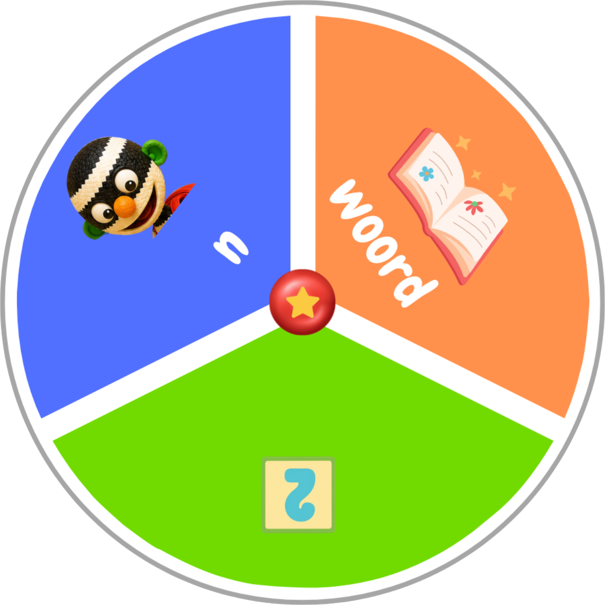

<!doctype html>
<html lang="nl">
<head>
  <meta charset="utf-8" />
  <meta name="viewport" content="width=device-width, initial-scale=1" />
  <title>Interactief rad</title>
  <link rel="stylesheet" href="style.css" />
</head>
<body>
  <main class="page">
    <section class="wheel-area" aria-label="Interactief keuzerad">
      

        
        
      

    </section>

    <aside class="controls" aria-label="Rad bedienen">
      <button class="color-button green" type="button" data-color="green" aria-label="Draai naar groen"></button>
      <button class="color-button orange" type="button" data-color="orange" aria-label="Draai naar oranje"></button>
      <button class="color-button blue" type="button" data-color="blue" aria-label="Draai naar blauw"></button>
    </aside>
  </main>

  
</body>
</html>
